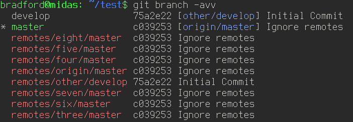
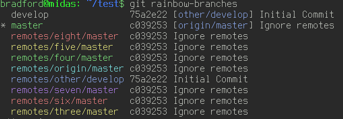

# git-rainbow-branches

An improved output of `git branch -avv` that provides different colors for each remote.

`git branch -avv` | `git rainbow-branches`
:----------------:|:---------------------:
 | 

**Note:** git-rainbow-branches is not a part of (or affiliated with) git.

## Installing

Use `./configure` to set install prefix if desired.

Then `make install`.

There is also an [AUR](https://aur.archlinux.org/packages/git-rainbow-branches/) package
that I maintain.
